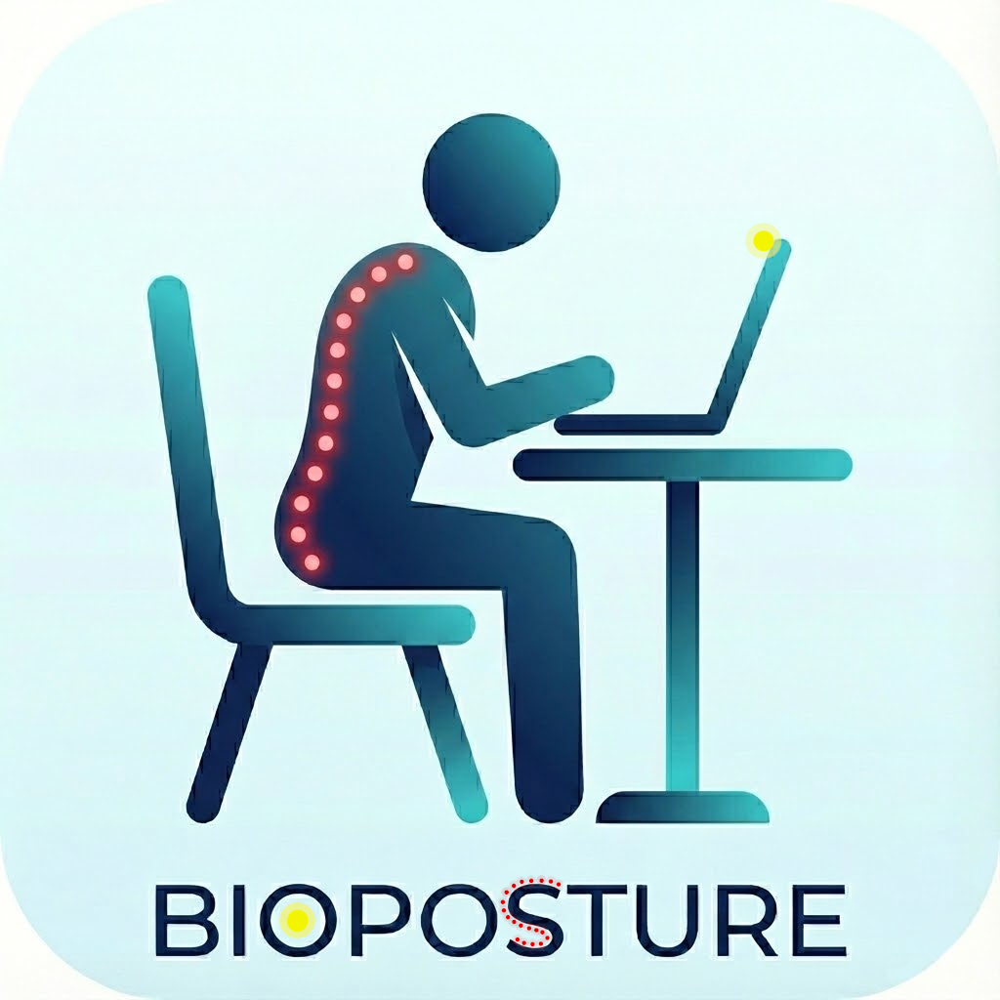
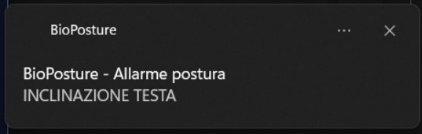
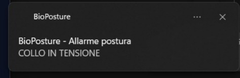
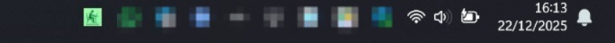
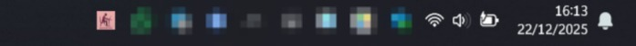

# 👨‍💻 BioPosture v2.0

<div align="center">



### 👨‍💻Sistema avanzato di monitoraggio posturale in tempo reale

**Monitoraggio ergonomico avanzato tramite Computer Vision & Machine Learning**

[](LICENSE.txt)
[]()
[](https://www.python.org/)
[](https://github.com/antdf87/BioPosture/releases)
[](https://github.com/antdf87/BioPosture/releases)

[📦 Installazione](#-installazione) • [✨ Features](#-caratteristiche-principali) • [🎯 Demo](#-interfaccia) • [🛠 Build](#-compilazione-da-sorgente) • [🤝 Contributi](#-contributi)

</div>

---

## 📋 Overview

**BioPosture** è una piattaforma software cross-platform progettata per l'analisi cinematica in tempo reale e il monitoraggio ergonomico del rachide cervicale. Sfruttando algoritmi di **Computer Vision** e reti neurali per la stima della posa (**MediaPipe Framework**), il sistema trasforma una comune webcam in un sensore biometrico di precisione.

L'obiettivo primario è la prevenzione dei disturbi muscolo-scheletrici (DMS) correlati all'uso prolungato di VDT (Videoterminali), fornendo biofeedback visivo immediato per correggere deviazioni posturali patomeccaniche (es. Text Neck Syndrome).

### 🎯 Caso d'Uso

- **Professionisti IT**: Sviluppatori, designer, analisti che lavorano 8+ ore al PC
- **Smart Workers**: Lavoratori da remoto senza postazioni ergonomiche certificate
- **Studenti**: Lunghe sessioni di studio al computer
- **Gamer**: Prevenzione infortuni durante sessioni prolungate
- **Uffici**: Implementazione programmi benessere aziendale

### 🔬 Tecnologie Core

| Tecnologia | Funzione | Versione |
|------------|----------|----------|
| **MediaPipe** | Stima posa 3D con 33 landmark corporei | 0.10+ |
| **OpenCV** | Elaborazione video real-time (30fps) | 4.8+ |
| **CustomTkinter** | UI moderna cross-platform | 5.2+ |
| **NumPy** | Calcoli vettoriali e smoothing | 1.24+ |

---

## ✨ Caratteristiche Principali

### 🎥 Monitoraggio Multi-Parametrico Real-Time

- **Inclinazione Testa (Head Tilt)**: Rilevazione rotazione cervicale (±90°)
- **Asimmetria Spalle (Shoulder Tilt)**: Analisi sbilanciamento carico muscolare
- **Distanza Schermo (Screen Distance)**: Monitoraggio basato su distanza interpupillare
- **Tensione Cervicale (Neck Compression)**: Ratio collo/testa per forward head posture

### ⚙️ Sistema di Calibrazione Intelligente

- **Calibrazione Personalizzata** (5 secondi): Adattamento alla morfologia individuale
- **Baseline Dinamica**: Riferimenti posturali specifici per ogni utente
- **Ricalibrazione On-Demand**: Aggiornamento parametri in qualsiasi momento

### 🔔 Notifiche Native Multi-OS

| Sistema Operativo | Metodo Notifica |
|-------------------|-----------------|
| Windows 10/11 | Windows Toast Notifications (winotify) |
| macOS | Notification Center (osascript) |
| Linux | Desktop Notifications (notify-send) |

- **Cooldown Configurabile**: Evita spam di notifiche (default: 8 secondi)
- **Tempo Allarme Ritardato**: Tolleranza errori transitori (default: 5 secondi)

### 📊 Analytics & Data Export

- **Efficienza Sessione**: Percentuale tempo con postura corretta
- **Grafico Real-Time**: Andamento temporale parametri critici (60 samples)
- **Export CSV**: Esportazione metriche per analisi approfondite
- **Persistenza Dati**: Configurazione salvata in JSON cross-platform

### 🎨 Interfaccia Utente Avanzata

- **Material Design Theme**: Palette professionale con glass morphism
- **Dark/Light Mode**: Cambio tema dinamico senza restart
- **System Tray Integration**: Funzionamento background discreto
- **Video Feed Ottimizzato**: Rendering 768px con overlay landmark

### 🚀 Automazione & Produttività

- **Autostart Cross-Platform**:
  - Windows: Registro `HKCU\Software\Microsoft\Windows\CurrentVersion\Run`
  - macOS: LaunchAgents (`~/Library/LaunchAgents/`)
  - Linux: Desktop files (`~/.config/autostart/`)
- **Avvio Minimizzato**: Flag `--minimized` per startup in tray
- **Pausa Intelligente**: Disattivazione temporanea senza chiudere l'app

---

## 🚀 Installazione

### 📦 Download Binari Pre-Compilati

#### Windows 10/11 (64-bit)

```powershell
# Scarica l'installer dalla pagina Releases
https://github.com/antdf87/BioPosture/releases/download/v2.0/BioPosture_Setup_v2.0.exe

# Esegui con privilegi amministratore
.\BioPosture_Setup_v2.0.exe
```

**Post-Installazione:**
- Shortcut Desktop automatico
- Entry nel Menu Start
- Disinstallazione da Pannello di Controllo

#### macOS Catalina 10.15+ (Intel & Apple Silicon)

```bash
# Scarica DMG
curl -L -o BioPosture.dmg \
  https://github.com/antdf87/BioPosture/releases/download/v2.0/BioPosture_v2.0_macOS.dmg

# Apri e installa
open BioPosture.dmg
# Trascina BioPosture.app in /Applications
```

**Primo Avvio:**
1. Tasto destro → **Apri** (bypass Gatekeeper)
2. Autorizza Camera: **System Settings → Privacy & Security → Camera**
3. Autorizza Notifiche: **System Settings → Notifications**

#### Linux (Ubuntu 20.04+ / Debian 11+)

```bash
# Download ed estrazione
wget https://github.com/antdf87/BioPosture/releases/download/v2.0/BioPosture_v2.0_linux_x86_64.tar.gz
tar -xzf BioPosture_v2.0_linux_x86_64.tar.gz

# Esecuzione
cd BioPosture_v2.0_linux_x86_64
./BioPosture

---

## 📖 Guida Utilizzo

### 🎬 Primo Avvio - Setup Rapido

1. **Avvio Applicazione**
   - Windows: Menu Start → BioPosture
   - macOS: Launchpad → BioPosture
   - Linux: Application Menu → BioPosture

2. **Calibrazione Iniziale** (OBBLIGATORIA)
   ```
   ┌─────────────────────────────────────────┐
   │  "Prima di iniziare il monitoraggio,    │
   │   è necessario calibrare il sistema"    │
   │                                         │
   │  1. Siediti in postura CORRETTA        │
   │  2. Guarda dritto la camera             │
   │  3. Click "AVVIA CALIBRAZIONE"          │
   │  4. Mantieni posizione per 5 secondi    │
   └─────────────────────────────────────────┘
   ```

3. **Conferma Calibrazione**
   - Status: `MONITORAGGIO ATTIVO` (verde)
   - Valori baseline salvati automaticamente

### 🎯 Interfaccia

#### Pannello Video (Sinistra)

```
┌────────────────────────────────────────┐
│  [Camera: 0 ▼] [Stop] [⚙️ Controls]   │
├────────────────────────────────────────┤
│                                        │
│      🎥 FEED WEBCAM + OVERLAY          │
│                                        │
│      • Landmark faccia (iris)          │
│      • Landmark corpo (orecchie/spalle)│
│      • Linee posturali                 │
│                                        │
└────────────────────────────────────────┘
```

#### Pannello Controllo (Destra)

**Card 1: Parametri Posturali**
```
╔═══════════════════════════════════════╗
║  PARAMETRI POSTURALI                  ║
╟───────────────────────────────────────╢
║  Inclinazione Testa     → 3.5°        ║
║  Asimmetria Spalle      → 2.1°        ║
║  Distanza Schermo       → 58 cm       ║
║  Tensione Cervicale     → 94%         ║
╚═══════════════════════════════════════╝
```

**Card 2: Efficienza Sessione**
```
╔═══════════════════════════════════════╗
║  EFFICIENZA SESSIONE                  ║
║  ████████████████░░░░  82%            ║
╚═══════════════════════════════════════╝
```

**Card 3: Grafico Real-Time**
```
╔═══════════════════════════════════════╗
║   Δ                                   ║
║   │   ╱╲    ╱╲                        ║
║   │  ╱  ╲  ╱  ╲   ╱╲                  ║
║   │ ╱    ╲╱    ╲ ╱  ╲                 ║
║   └─────────────────────> t           ║
║     Testa (rosso) | Collo (verde)     ║
╚═══════════════════════════════════════╝
```

**Card 4: Configurazione**
```
╔═══════════════════════════════════════╗
║  SOGLIA TOLLERANZA                    ║
║  [━━━━━━━●━━━━━] 50%                  ║
║                                       ║
║  ☑ Autostart  ☑ Notifiche  ☐ Light   ║
╚═══════════════════════════════════════╝
```

### ⚡ Funzionalità Avanzate

| Funzione | Hotkey | Descrizione |
|----------|--------|-------------|
| **Ricalibra** | - | Aggiorna baseline posturale |
| **Pausa** | - | Disattiva monitoraggio temporaneo |
| **Stop Camera** | - | Ferma acquisizione video |
| **Salva KPI** | - | Esporta CSV con metriche sessione |
| **Riduci a Tray** | Close Window | Continua monitoraggio in background |

### 🎛️ Configurazione Avanzata

#### Modifica Soglie (File: `config.json`)

```json
{
  "thresholds": {
    "soglia_angoli": 10.0,        // Tolleranza inclinazione (gradi)
    "soglia_dist_max": 1.35,      // Distanza massima (ratio)
    "soglia_dist_min": 0.65,      // Distanza minima (ratio)
    "soglia_compressione": 0.85,  // Tensione cervicale (ratio)
    "tempo_allarme": 5.0,         // Secondi prima allarme
    "cooldown_notifica": 8.0      // Secondi tra notifiche
  }
}
```

**Location file config:**
- Windows: `%APPDATA%\BioPosture\config.json`
- macOS: `~/Library/Application Support/BioPosture/config.json`
- Linux: `~/.config/BioPosture/config.json`

---
## 📸 Screenshots

<div align="center">

### Interfaccia Principale


### Processo di Calibrazione


### Allarme Postura


### Notifica allarme



### System Tray



</div>
---

## 🛠 Compilazione da Sorgente

### 📋 Requisiti Sistema

| Componente | Minimo | Raccomandato |
|------------|--------|--------------|
| **RAM** | 4GB | 8GB |
| **CPU** | Dual-core 2.0GHz | Quad-core 2.5GHz+ |
| **Webcam** | 720p 30fps | 1080p 30fps |
| **Python** | 3.8 | 3.11 |
| **Storage** | 500MB | 1GB |

### 🔧 Setup Ambiente Sviluppo

#### 1. Clone Repository

```bash
git clone https://github.com/antdf87/BioPosture.git
cd BioPosture
```

#### 2. Ambiente Virtuale

**Windows:**
```powershell
python -m venv venv
venv\Scripts\activate
```

**macOS/Linux:**
```bash
python3 -m venv venv
source venv/bin/activate
```

#### 3. Installazione Dipendenze

```bash
pip install --upgrade pip
pip install -r requirements.txt
```

**Dipendenze Core:**
```
customtkinter==5.2.0    # UI Framework
opencv-python==4.8.0    # Computer Vision
mediapipe==0.10.0       # Pose Estimation
numpy==1.24.0           # Numeric Computing
Pillow==10.0.0          # Image Processing
pystray==0.19.0         # System Tray
pyinstaller==6.0.0      # Packaging
winotify==1.1.0         # Windows Notifications (Windows only)
```

#### 4. Verifica Setup

```bash
python bioposture_interface.py
```

### 🏗️ Build Installer per Distribuzione

#### Windows

```bash
# 1. Compila binario
python build_scripts\build_windows.py

# Output: dist\BioPosture.exe (standalone)

# 2. Crea installer NSIS
# Prerequisito: NSIS installato (https://nsis.sourceforge.io/)
# Tasto destro su installers\windows\installer.nsi → "Compile NSIS Script"

# Output: BioPosture_Setup_v2.0.exe
```

**Dimensione finale:** ~220MB (include Python runtime + librerie)

#### macOS

```bash
# 1. Genera icona .icns
mkdir BioPosture.iconset
# ... (genera tutte le dimensioni)
iconutil -c icns BioPosture.iconset -o BioPosture.icns

# 2. Compila bundle
python build_scripts/build_macos.py

# Output: dist/BioPosture.app

# 3. (Opzionale) Crea DMG
brew install create-dmg
create-dmg \
  --volname "BioPosture Installer" \
  --window-size 800 400 \
  --icon "BioPosture.app" 200 190 \
  --app-drop-link 600 185 \
  "BioPosture_v2.0_macOS.dmg" \
  "dist/BioPosture.app"
```

**Dimensione finale:** ~70MB (bundle universale Intel/ARM)

#### Linux

```bash
# 1. Installa dipendenze sistema
sudo apt install python3-tk libnotify-bin libgtk-3-0

# 2. Compila binario
python build_scripts/build_linux.py

# Output: dist/BioPosture

# 3. (Opzionale) Crea .deb
# Vedi: build_scripts/create_deb.sh

# 4. (Opzionale) Crea AppImage
# Vedi: build_scripts/create_appimage.sh
```

**Dimensione finale:** ~150MB (include Python + dipendenze)

---

## 📊 Architettura Tecnica

### 🏗️ Stack Diagram

```
┌─────────────────────────────────────────────────────────────┐
│                    BioPosture Application                   │
│                  (bioposture_interface.py)                  │
└────────────┬───────────────────────────────┬────────────────┘
             │                               │
    ┌────────▼────────┐            ┌────────▼────────┐
    │  UI Layer       │            │  Core Engine    │
    │  CustomTkinter  │            │  Processing     │
    │  + Pystray      │            │                 │
    └────────┬────────┘            └────────┬────────┘
             │                               │
    ┌────────▼────────┐            ┌────────▼─────────────────┐
    │  Config Mgr     │            │  Computer Vision Pipeline │
    │  - JSON I/O     │            │  ┌─────────────────────┐ │
    │  - Persistence  │            │  │ OpenCV Camera       │ │
    │                 │            │  │ (30 FPS capture)    │ │
    │  Autostart Mgr  │            │  └──────────┬──────────┘ │
    │  - Registry/    │            │             │            │
    │    LaunchAgent/ │            │  ┌──────────▼──────────┐ │
    │    .desktop     │            │  │ MediaPipe Face Mesh │ │
    └─────────────────┘            │  │ (468 landmarks)     │ │
                                   │  └──────────┬──────────┘ │
                                   │             │            │
                                   │  ┌──────────▼──────────┐ │
                                   │  │ MediaPipe Pose      │ │
                                   │  │ (33 landmarks)      │ │
                                   │  └──────────┬──────────┘ │
                                   │             │            │
                                   │  ┌──────────▼──────────┐ │
                                   │  │ Geometry Calculator │ │
                                   │  │ - Angles            │ │
                                   │  │ - Distances         │ │
                                   │  │ - Ratios            │ │
                                   │  └──────────┬──────────┘ │
                                   │             │            │
                                   │  ┌──────────▼──────────┐ │
                                   │  │ Data Smoother       │ │
                                   │  │ (Exponential MA)    │ │
                                   │  └──────────┬──────────┘ │
                                   │             │            │
                                   │  ┌──────────▼──────────┐ │
                                   │  │ Threshold Evaluator │ │
                                   │  │ + Severity Scaling  │ │
                                   │  └─────────────────────┘ │
                                   └─────────────────────────┘
```

### 🔄 Processing Pipeline

```
Camera Frame (30 FPS)
    │
    ├─→ RGB Conversion
    │
    ├─→ MediaPipe Face Detection
    │   └─→ Iris Landmarks (468, 473)
    │       └─→ Interpupillary Distance
    │
    ├─→ MediaPipe Pose Detection
    │   └─→ Upper Body Landmarks (7, 8, 11, 12)
    │       ├─→ Head Tilt Angle (ear-ear line)
    │       ├─→ Shoulder Tilt Angle (shoulder-shoulder line)
    │       └─→ Neck Length Ratio (ear-shoulder distance)
    │
    ├─→ Exponential Moving Average Smoothing (α=0.7-0.8)
    │
    ├─→ Threshold Evaluation
    │   ├─→ Calibration Baseline Δ
    │   ├─→ Severity Factor Scaling
    │   └─→ Temporal Delay (5s default)
    │
    ├─→ Status Update (UI + Tray Icon Color)
    │
    └─→ Notification Dispatch (if threshold exceeded)
        └─→ OS-Specific Method
            ├─→ Windows: winotify
            ├─→ macOS: osascript
            └─→ Linux: notify-send
```

### 📐 Algoritmi Chiave

#### 1. Calcolo Angolo Inclinazione

```python
def calc_angle(p1: np.ndarray, p2: np.ndarray) -> float:
    """
    Calcola angolo tra due punti rispetto all'orizzontale.
    
    Args:
        p1, p2: Coordinate [x, y] in pixel
    
    Returns:
        Angolo in gradi [-180, 180]
    """
    return np.degrees(np.arctan2(p2[1] - p1[1], p2[0] - p1[0]))
```

#### 2. Data Smoothing (Exponential Moving Average)

```python
class DataSmoother:
    def __init__(self, alpha: float = 0.75):
        """
        Args:
            alpha: Smoothing factor [0,1]
                   0 = no smoothing, 1 = maximum smoothing
        """
        self.alpha = alpha
        self.val = None
    
    def update(self, new_val: float) -> float:
        if self.val is None:
            self.val = new_val
        else:
            self.val = self.alpha * new_val + (1 - self.alpha) * self.val
        return self.val
```

#### 3. Severity Scaling Dinamico

```python
# Utente imposta severity 0-100%
severity = config["ui"]["severity"] / 100.0

# Fattori di tolleranza
tolerance_factor = 1.5 - severity  # [0.5, 1.5]
time_factor = 2.0 - (severity * 1.5)  # [0.5, 2.0]

# Soglie adattive
angle_threshold = base_angle_threshold * tolerance_factor
alert_delay = base_alert_delay * time_factor
```

---

## 🔬 Validazione & Testing

### ✅ Test Matrix

| Piattaforma | Versione | Camera | System Tray | Notifiche | Autostart |
|-------------|----------|--------|-------------|-----------|-----------|
| Windows 10 | 22H2 | ✅ | ✅ | ✅ | ✅ |
| Windows 11 | 23H2 | ✅ | ✅ | ✅ | ✅ |
| macOS Monterey | 12.7 | ✅ | ✅ | ✅ | ✅ |
| macOS Ventura | 13.6 | ✅ | ✅ | ✅ | ✅ |
| macOS Sonoma | 14.2 | ✅ | ✅ | ✅ | ✅ |
| Ubuntu | 22.04 LTS | ✅ | ✅ | ✅ | ✅ |
| Ubuntu | 24.04 LTS | ✅ | ✅ | ✅ | ✅ |
| Debian | 12 | ✅ | ✅ | ✅ | ✅ |


### 🐛 Known Issues

1. **macOS < 10.15**: MediaPipe non supportato (richiede Catalina+)
2. **Linux Wayland**: System tray potrebbe non apparire (limitazione X11)
3. **Chromebook Linux (Crostini)**: Camera non condivisa con container

---

## 🤝 Contributi

I contributi sono **fortemente benvenuti**! BioPosture è un progetto open-source che migliora con il feedback della community.

### 🎯 Aree di Contributo

| Area | Priorità | Competenze |
|------|----------|------------|
| **Algoritmi Posturali** | 🔴 Alta | Computer Vision, Biomeccanica |
| **UI/UX Improvements** | 🟠 Media | Design, Tkinter |
| **Testing Cross-Platform** | 🟡 Media | QA, Multi-OS |
| **Documentazione** | 🟢 Bassa | Technical Writing |
| **Traduzioni** | 🟢 Bassa | Lingue straniere |


### 🐛 Segnalare Bug

Apri una [Issue](https://github.com/antdf87/BioPosture/issues/new) con:

```markdown
**Descrizione Bug:**
[Descrizione chiara e concisa]

**Passi per Riprodurre:**
1. Apri applicazione
2. Esegui azione X
3. Osserva comportamento Y

**Comportamento Atteso:**
[Cosa dovrebbe accadere]

**Comportamento Attuale:**
[Cosa accade invece]

**Environment:**
- OS: [Windows 11 / macOS 14.2 / Ubuntu 22.04]
- Versione BioPosture: [2.0]
- Webcam: [Modello]

**Screenshot/Log:**
[Allega se disponibile]
```

### 💡 Proporre Features

Apri una [Discussion](https://github.com/antdf87/BioPosture/discussions/new?category=ideas) per discutere l'idea **prima** di implementarla.

---

## 📄 Licenza

Questo progetto è rilasciato sotto **MIT License**.

```
MIT License

Copyright (c) 2025 AntDF87

Permission is hereby granted, free of charge, to any person obtaining a copy
of this software and associated documentation files (the "Software"), to deal
in the Software without restriction, including without limitation the rights
to use, copy, modify, merge, publish, distribute, sublicense, and/or sell
copies of the Software, and to permit persons to whom the Software is
furnished to do so, subject to the following conditions:

[... vedi LICENSE.txt per testo completo]
```


## 👨‍💻 Autore

**Antonio Del Fine (AntDF87)**  
*Engineering & Biomedical Solutions*

- 🐙 GitHub: [@antdf87](https://github.com/antdf87)
- 📧 Issues & Support: [GitHub Issues](https://github.com/antdf87/BioPosture/issues)

---
## 📚 Citazione

Se utilizzi questo software per scopi accademici o di ricerca, per favore cita il progetto utilizzando il file CITATION.cff incluso o il seguente formato BibTeX:

@software{BioPosture2025,
  author = {AntDF87},
  title = {BioPosture: Markerless Kinematic Analysis System},
  year = {2025},
  version = {2.0.0},
  url = {[https://github.com/antdf87/BioPosture](https://github.com/antdf87/BioPosture)}
}

## 🙏 Ringraziamenti

Questo progetto non sarebbe possibile senza:

- **[Google MediaPipe](https://google.github.io/mediapipe/)** - Framework ML per pose estimation
- **[OpenCV Foundation](https://opencv.org/)** - Computer Vision library
- **[Tom Schimansky](https://github.com/TomSchimansky)** - CustomTkinter framework
- **[Moses Palmer](https://github.com/moses-palmer)** - Pystray library
- **Comunità Open Source** - Per feedback e contributi

---

### 🆘 Hai bisogno di aiuto?

1. **Documentazione**: Leggi questa guida completa
2. **FAQ**: Controlla [Wiki](https://github.com/antdf87/BioPosture/wiki) (coming soon)
3. **Issues**: Cerca tra [issues esistenti](https://github.com/antdf87/BioPosture/issues)
4. **Discussions**: Chiedi alla [community](https://github.com/antdf87/BioPosture/discussions)

### 🌟 Ti piace BioPosture?

- ⭐ **Lascia una stella** su GitHub
- 📢 **Condividi** con colleghi e amici
- ☕ **Supporta** lo sviluppo (coming soon)

---

## 🗺️ Roadmap

### v2.1 (Q2 2025)

- [ ] **Machine Learning
