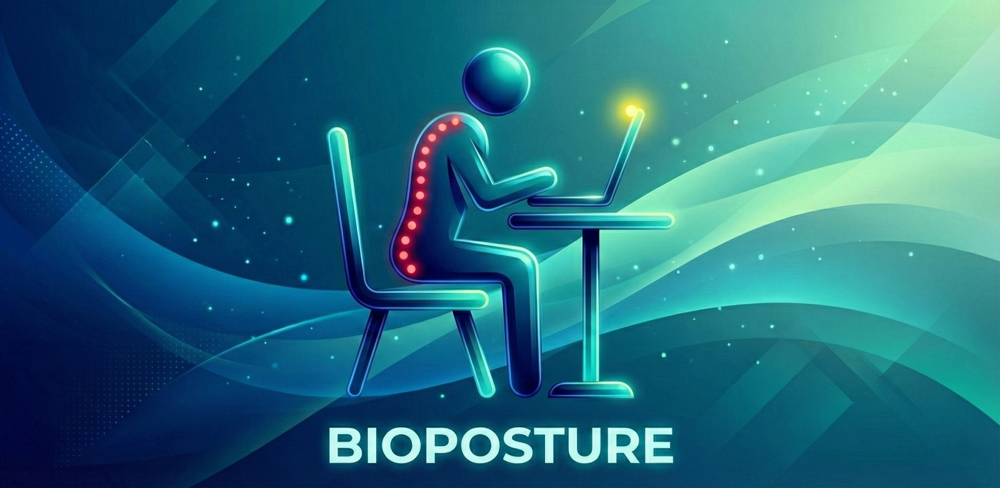
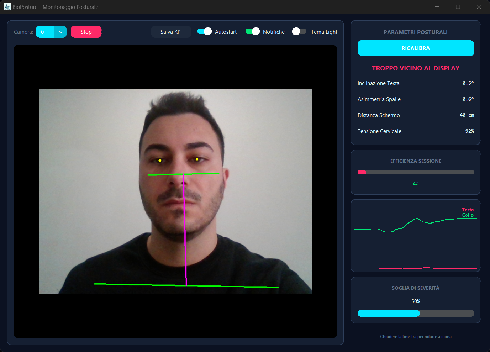
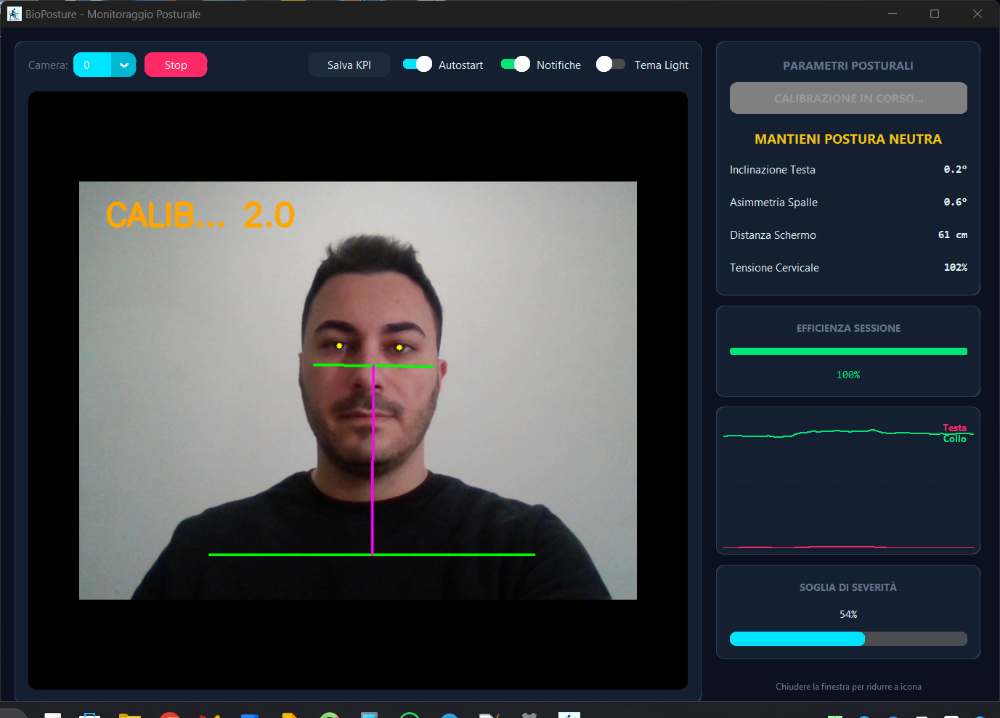
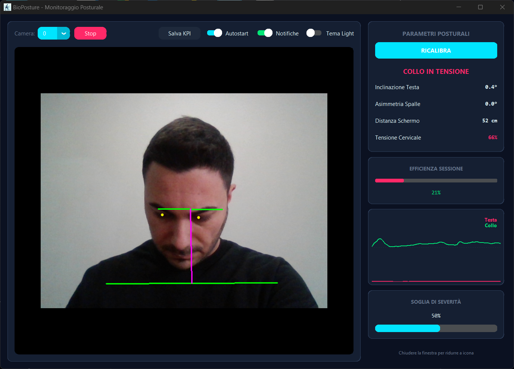
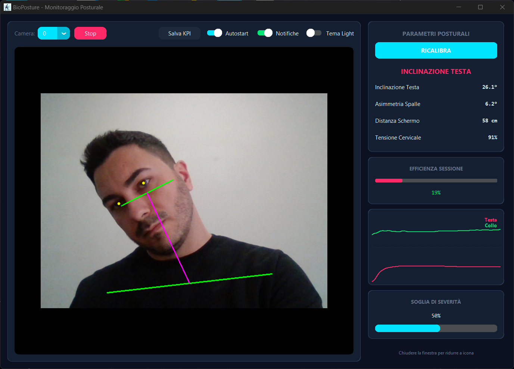
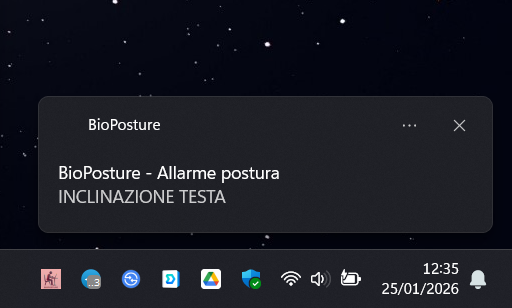
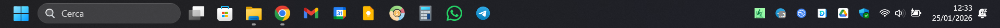

# 🏥 BioPosture v2.0

<div align="center">



### Real-Time Postural Monitoring System

**Advanced ergonomic monitoring via Computer Vision & Machine Learning**

[](LICENSE.txt)
[]()
[](https://www.python.org/)
[](https://github.com/antdf87/BioPosture/releases)
[](https://github.com/antdf87/BioPosture/releases)

[📦 Installation](#-installation) • [✨ Features](#-key-features) • [🎯 Interface](#-interface) • [🛠 Build](#-build-from-source) • [🤝 Contributing](#-contributing)

</div>

---

## 📋 Overview

**BioPosture** is a cross-platform software platform for real-time kinematic analysis and ergonomic monitoring of the cervical spine. By leveraging **Computer Vision** algorithms and neural networks for pose estimation (**MediaPipe Framework**), the system turns a standard webcam into a precision biometric sensor.

The primary goal is the prevention of musculoskeletal disorders (MSDs) related to prolonged VDT (Video Display Terminal) use, providing immediate visual biofeedback to correct pathomechanical postural deviations such as **Text Neck Syndrome**.

> **Research background**: BioPosture was developed as part of an experimental study (N=20 subjects, age 14–80) that validated markerless cervical posture assessment against goniometry using Bland-Altman analysis (bias: +1.67°, LoA: ±4.10°, r=0.96). The study demonstrated a statistically significant postural worsening (+7° CSA, p=0.0215) and screen approach (−5.7 cm, p=0.0006) under cognitive load.

### 🎯 Use Cases

- **IT Professionals**: Developers, designers, analysts working 8+ hours at a computer
- **Remote Workers**: Working from home without certified ergonomic setups
- **Students**: Long study sessions at the computer
- **Gamers**: Injury prevention during extended gaming sessions
- **Offices**: Corporate wellness program implementation

### 🔬 Core Technologies

| Technology | Function | Version |
|------------|----------|---------|
| **MediaPipe** | 3D pose estimation with 33 body landmarks + 468 face mesh landmarks | 0.10+ |
| **OpenCV** | Real-time video processing (30 fps) | 4.8+ |
| **CustomTkinter** | Modern cross-platform UI | 5.2+ |
| **NumPy** | Vector computation and signal smoothing | 1.24+ |

---

## ✨ Key Features

### 🎥 Real-Time Multi-Parameter Monitoring

- **Head Tilt**: Cervical rotation detection (±90°)
- **Shoulder Asymmetry**: Muscular load imbalance analysis
- **Screen Distance**: Monitoring based on interpupillary distance proxy
- **Cervical Tension**: Ear-shoulder ratio for forward head posture detection

### ⚙️ Intelligent Calibration System

- **Personalized Calibration** (5 seconds): Morphological adaptation per user
- **Dynamic Baseline**: User-specific postural reference points
- **On-Demand Recalibration**: Update parameters at any time

### 🔔 Native Multi-OS Notifications

| Operating System | Notification Method |
|------------------|---------------------|
| Windows 10/11 | Windows Toast Notifications (winotify) |
| macOS | Notification Center (osascript) |
| Linux | Desktop Notifications (notify-send) |

- **Configurable Cooldown**: Prevents notification spam (default: 8 seconds)
- **Delayed Alert Timer**: Tolerance for transient errors (default: 5 seconds)

### 📊 Analytics & Data Export

- **Session Efficiency**: Percentage of time with correct posture
- **Real-Time Chart**: Temporal trend of critical parameters (60 samples)
- **CSV Export**: Metrics export for in-depth analysis
- **Data Persistence**: Configuration saved in cross-platform JSON

### 🎨 Advanced User Interface

- **Material Design Theme**: Professional palette with glass morphism
- **Dark/Light Mode**: Dynamic theme switching without restart
- **System Tray Integration**: Discreet background operation
- **Optimized Video Feed**: 768px rendering with landmark overlay

### 🚀 Automation & Productivity

- **Cross-Platform Autostart**:
  - Windows: Registry `HKCU\Software\Microsoft\Windows\CurrentVersion\Run`
  - macOS: LaunchAgents (`~/Library/LaunchAgents/`)
  - Linux: Desktop files (`~/.config/autostart/`)
- **Minimized Launch**: `--minimized` flag for startup to tray
- **Smart Pause**: Temporary deactivation without closing the app

---

## 🚀 Installation

### 📦 Pre-Built Binaries

#### Windows 10/11 (64-bit)

```powershell
# Download installer from Releases page
https://github.com/antdf87/BioPosture/releases/download/v2.0/BioPosture_Setup_v2.0.exe

# Run with administrator privileges
.\BioPosture_Setup_v2.0.exe
```

**Post-Installation:**
- Automatic Desktop shortcut
- Start Menu entry
- Uninstall via Control Panel

#### macOS Catalina 10.15+ (Intel & Apple Silicon)

```bash
# Download DMG
curl -L -o BioPosture.dmg \
  https://github.com/antdf87/BioPosture/releases/download/v2.0/BioPosture_v2.0_macOS.dmg

# Open and install
open BioPosture.dmg
# Drag BioPosture.app to /Applications
```

**First Launch:**
1. Right-click → **Open** (bypass Gatekeeper)
2. Allow Camera: **System Settings → Privacy & Security → Camera**
3. Allow Notifications: **System Settings → Notifications**

#### Linux (Ubuntu 20.04+ / Debian 11+)

```bash
# Download and extract
wget https://github.com/antdf87/BioPosture/releases/download/v2.0/BioPosture_v2.0_linux_x86_64.tar.gz
tar -xzf BioPosture_v2.0_linux_x86_64.tar.gz

# Run
cd BioPosture_v2.0_linux_x86_64
./BioPosture
```

---

## 📖 Usage Guide

### 🎬 First Launch — Quick Setup

1. **Launch Application**
   - Windows: Start Menu → BioPosture
   - macOS: Launchpad → BioPosture
   - Linux: Application Menu → BioPosture

2. **Initial Calibration** (REQUIRED)
   ```
   ┌─────────────────────────────────────────┐
   │  Before starting monitoring,            │
   │  you need to calibrate the system:      │
   │                                         │
   │  1. Sit in CORRECT posture              │
   │  2. Look straight at the camera         │
   │  3. Click "START CALIBRATION"           │
   │  4. Hold position for 5 seconds         │
   └─────────────────────────────────────────┘
   ```

3. **Calibration Confirmation**
   - Status: `MONITORING ACTIVE` (green)
   - Baseline values saved automatically

### 🎯 Interface

#### Video Panel (Left)

```
┌────────────────────────────────────────┐
│  [Camera: 0 ▼] [Stop] [⚙️ Controls]   │
├────────────────────────────────────────┤
│                                        │
│      🎥 WEBCAM FEED + OVERLAY          │
│                                        │
│      • Face landmarks (iris)           │
│      • Body landmarks (ears/shoulders) │
│      • Postural reference lines        │
│                                        │
└────────────────────────────────────────┘
```

#### Control Panel (Right)

**Card 1: Postural Parameters**
```
╔═══════════════════════════════════════╗
║  POSTURAL PARAMETERS                  ║
╟───────────────────────────────────────╢
║  Head Tilt              → 3.5°        ║
║  Shoulder Asymmetry     → 2.1°        ║
║  Screen Distance        → 58 cm       ║
║  Cervical Tension       → 94%         ║
╚═══════════════════════════════════════╝
```

**Card 2: Session Efficiency**
```
╔═══════════════════════════════════════╗
║  SESSION EFFICIENCY                   ║
║  ████████████████░░░░  82%            ║
╚═══════════════════════════════════════╝
```

**Card 3: Real-Time Chart**
```
╔═══════════════════════════════════════╗
║   Δ                                   ║
║   │   ╱╲    ╱╲                        ║
║   │  ╱  ╲  ╱  ╲   ╱╲                  ║
║   │ ╱    ╲╱    ╲ ╱  ╲                 ║
║   └─────────────────────> t           ║
║     Head (red) | Neck (green)         ║
╚═══════════════════════════════════════╝
```

**Card 4: Configuration**
```
╔═══════════════════════════════════════╗
║  TOLERANCE THRESHOLD                  ║
║  [━━━━━━━●━━━━━] 50%                  ║
║                                       ║
║  ☑ Autostart  ☑ Notifications  ☐ Light║
╚═══════════════════════════════════════╝
```

### ⚡ Advanced Features

| Function | Description |
|----------|-------------|
| **Recalibrate** | Update postural baseline |
| **Pause** | Temporarily disable monitoring |
| **Stop Camera** | Stop video acquisition |
| **Save KPIs** | Export CSV with session metrics |
| **Minimize to Tray** | Continue monitoring in background |

### 🎛️ Advanced Configuration

#### Modify Thresholds (`config.json`)

```json
{
  "thresholds": {
    "soglia_angoli": 10.0,        // Angle tolerance (degrees)
    "soglia_dist_max": 1.35,      // Maximum distance (ratio)
    "soglia_dist_min": 0.65,      // Minimum distance (ratio)
    "soglia_compressione": 0.85,  // Cervical tension (ratio)
    "tempo_allarme": 5.0,         // Seconds before alert
    "cooldown_notifica": 8.0      // Seconds between notifications
  }
}
```

**Config file location:**
- Windows: `%APPDATA%\BioPosture\config.json`
- macOS: `~/Library/Application Support/BioPosture/config.json`
- Linux: `~/.config/BioPosture/config.json`

---

## 📸 Screenshots

<div align="center">

### Main Interface


### Calibration Process


### Posture Alert



### Alert Notification



### System Tray



</div>

---

## 🛠 Build from Source

### 📋 System Requirements

| Component | Minimum | Recommended |
|-----------|---------|-------------|
| **RAM** | 4 GB | 8 GB |
| **CPU** | Dual-core 2.0 GHz | Quad-core 2.5 GHz+ |
| **Webcam** | 720p 30fps | 1080p 30fps |
| **Python** | 3.8 | 3.11 |
| **Storage** | 500 MB | 1 GB |

### 🔧 Development Environment Setup

#### 1. Clone Repository

```bash
git clone https://github.com/antdf87/BioPosture.git
cd BioPosture
```

#### 2. Virtual Environment

**Windows:**
```powershell
python -m venv venv
venv\Scripts\activate
```

**macOS/Linux:**
```bash
python3 -m venv venv
source venv/bin/activate
```

#### 3. Install Dependencies

```bash
pip install --upgrade pip
pip install -r requirements.txt
```

**Core dependencies:**
```
customtkinter==5.2.0    # UI Framework
opencv-python==4.8.0    # Computer Vision
mediapipe==0.10.0       # Pose Estimation
numpy==1.24.0           # Numeric Computing
Pillow==10.0.0          # Image Processing
pystray==0.19.0         # System Tray
pyinstaller==6.0.0      # Packaging
winotify==1.1.0         # Windows Notifications (Windows only)
```

#### 4. Verify Setup

```bash
python bioposture_interface.py
```

### 🏗️ Build Installer for Distribution

#### Windows

```bash
# 1. Compile binary
python build_scripts\build_windows.py
# Output: dist\BioPosture.exe (standalone)

# 2. Create NSIS installer
# Prerequisite: NSIS installed (https://nsis.sourceforge.io/)
# Right-click installers\windows\installer.nsi → "Compile NSIS Script"
# Output: BioPosture_Setup_v2.0.exe
```

**Final size:** ~220 MB (includes Python runtime + libraries)

#### macOS

```bash
# 1. Generate .icns icon
mkdir BioPosture.iconset
# ... (generate all sizes)
iconutil -c icns BioPosture.iconset -o BioPosture.icns

# 2. Compile bundle
python build_scripts/build_macos.py
# Output: dist/BioPosture.app

# 3. (Optional) Create DMG
brew install create-dmg
create-dmg \
  --volname "BioPosture Installer" \
  --window-size 800 400 \
  --icon "BioPosture.app" 200 190 \
  --app-drop-link 600 185 \
  "BioPosture_v2.0_macOS.dmg" \
  "dist/BioPosture.app"
```

**Final size:** ~70 MB (universal Intel/ARM bundle)

#### Linux

```bash
# 1. Install system dependencies
sudo apt install python3-tk libnotify-bin libgtk-3-0

# 2. Compile binary
python build_scripts/build_linux.py
# Output: dist/BioPosture

# 3. (Optional) Create .deb → see build_scripts/create_deb.sh
# 4. (Optional) Create AppImage → see build_scripts/create_appimage.sh
```

**Final size:** ~150 MB (includes Python + dependencies)

---

## 📊 Technical Architecture

### 🏗️ Stack Diagram

```
┌─────────────────────────────────────────────────────────────┐
│                    BioPosture Application                   │
│                  (bioposture_interface.py)                  │
└────────────┬───────────────────────────────┬────────────────┘
             │                               │
    ┌────────▼────────┐            ┌────────▼────────┐
    │  UI Layer       │            │  Core Engine    │
    │  CustomTkinter  │            │  Processing     │
    │  + Pystray      │            │                 │
    └────────┬────────┘            └────────┬────────┘
             │                               │
    ┌────────▼────────┐            ┌────────▼─────────────────┐
    │  Config Manager │            │  Computer Vision Pipeline │
    │  - JSON I/O     │            │  ┌─────────────────────┐ │
    │  - Persistence  │            │  │ OpenCV Camera       │ │
    │                 │            │  │ (30 FPS capture)    │ │
    │  Autostart Mgr  │            │  └──────────┬──────────┘ │
    │  - Registry/    │            │             │            │
    │    LaunchAgent/ │            │  ┌──────────▼──────────┐ │
    │    .desktop     │            │  │ MediaPipe Face Mesh │ │
    └─────────────────┘            │  │ (468 landmarks)     │ │
                                   │  └──────────┬──────────┘ │
                                   │             │            │
                                   │  ┌──────────▼──────────┐ │
                                   │  │ MediaPipe Pose      │ │
                                   │  │ (33 landmarks)      │ │
                                   │  └──────────┬──────────┘ │
                                   │             │            │
                                   │  ┌──────────▼──────────┐ │
                                   │  │ Geometry Calculator │ │
                                   │  │ - Angles            │ │
                                   │  │ - Distances         │ │
                                   │  │ - Ratios            │ │
                                   │  └──────────┬──────────┘ │
                                   │             │            │
                                   │  ┌──────────▼──────────┐ │
                                   │  │ EMA Data Smoother   │ │
                                   │  │ (α = 0.75 default)  │ │
                                   │  └──────────┬──────────┘ │
                                   │             │            │
                                   │  ┌──────────▼──────────┐ │
                                   │  │ Threshold Evaluator │ │
                                   │  │ + Severity Scaling  │ │
                                   │  └─────────────────────┘ │
                                   └─────────────────────────┘
```

### 🔄 Processing Pipeline

```
Camera Frame (30 FPS)
    │
    ├─→ RGB Conversion
    │
    ├─→ MediaPipe Face Detection
    │   └─→ Iris Landmarks (468, 473)
    │       └─→ Interpupillary Distance
    │
    ├─→ MediaPipe Pose Detection
    │   └─→ Upper Body Landmarks (7, 8, 11, 12)
    │       ├─→ Head Tilt Angle     [arctan2(ear_r - ear_l)]
    │       ├─→ Shoulder Tilt Angle [arctan2(sh_r - sh_l)]
    │       └─→ Neck Length Ratio   [dist(ear, shoulder) / dist_iris]
    │
    ├─→ Exponential Moving Average Smoothing (α = 0.7–0.8)
    │
    ├─→ Threshold Evaluation
    │   ├─→ Calibration Baseline Δ
    │   ├─→ Severity Factor Scaling
    │   └─→ Temporal Delay (5s default)
    │
    ├─→ Status Update (UI + Tray Icon Color)
    │
    └─→ Notification Dispatch (if threshold exceeded)
        └─→ OS-Specific Method
            ├─→ Windows : winotify
            ├─→ macOS   : osascript
            └─→ Linux   : notify-send
```

### 📐 Key Algorithms

#### 1. Angle Calculation

```python
def calc_angle(p1: np.ndarray, p2: np.ndarray) -> float:
    """
    Calculates the angle between two points relative to horizontal.

    Args:
        p1, p2: Coordinates [x, y] in pixels

    Returns:
        Angle in degrees [-180, 180]
    """
    return np.degrees(np.arctan2(p2[1] - p1[1], p2[0] - p1[0]))
```

#### 2. EMA Signal Smoothing

```python
class DataSmoother:
    def __init__(self, alpha: float = 0.75):
        """
        Exponential Moving Average filter for real-time noise reduction.

        Args:
            alpha: Smoothing factor [0, 1]
                   Low alpha = more smoothing (slower response)
                   High alpha = less smoothing (faster response)
        """
        self.alpha = alpha
        self.val = None

    def update(self, new_val: float) -> float:
        if self.val is None:
            self.val = new_val
        else:
            self.val = self.alpha * new_val + (1 - self.alpha) * self.val
        return self.val
```

#### 3. Dynamic Severity Scaling

```python
# User sets severity 0–100%
severity = config["ui"]["severity"] / 100.0

# Adaptive tolerance factors
tolerance_factor = 1.5 - severity        # range [0.5, 1.5]
time_factor      = 2.0 - (severity * 1.5)  # range [0.5, 2.0]

# Adaptive thresholds
angle_threshold = base_angle_threshold * tolerance_factor
alert_delay     = base_alert_delay     * time_factor
# High severity → tighter threshold + faster alert
```

---

## 🔬 Validation & Testing

### ✅ Test Matrix

| Platform | Version | Camera | System Tray | Notifications | Autostart |
|----------|---------|--------|-------------|---------------|-----------|
| Windows 10 | 22H2 | ✅ | ✅ | ✅ | ✅ |
| Windows 11 | 23H2 | ✅ | ✅ | ✅ | ✅ |
| macOS Monterey | 12.7 | ✅ | ✅ | ✅ | ✅ |
| macOS Ventura | 13.6 | ✅ | ✅ | ✅ | ✅ |
| macOS Sonoma | 14.2 | ✅ | ✅ | ✅ | ✅ |
| Ubuntu | 22.04 LTS | ✅ | ✅ | ✅ | ✅ |
| Ubuntu | 24.04 LTS | ✅ | ✅ | ✅ | ✅ |
| Debian | 12 | ✅ | ✅ | ✅ | ✅ |

### 🐛 Known Issues

1. **macOS < 10.15**: MediaPipe not supported (requires Catalina+)
2. **Linux Wayland**: System tray may not appear (X11 limitation)
3. **Chromebook Linux (Crostini)**: Camera not shared with container

---

## 🤝 Contributing

Contributions are **strongly welcome**! BioPosture is an open-source project that improves with community feedback.

### 🎯 Contribution Areas

| Area | Priority | Skills |
|------|----------|--------|
| **Postural Algorithms** | 🔴 High | Computer Vision, Biomechanics |
| **UI/UX Improvements** | 🟠 Medium | Design, Tkinter |
| **Cross-Platform Testing** | 🟡 Medium | QA, Multi-OS |
| **Documentation** | 🟢 Low | Technical Writing |
| **Translations** | 🟢 Low | Foreign languages |

### 🐛 Reporting Bugs

Open an [Issue](https://github.com/antdf87/BioPosture/issues/new) with:

```markdown
**Bug Description:**
[Clear and concise description]

**Steps to Reproduce:**
1. Open application
2. Perform action X
3. Observe behavior Y

**Expected Behavior:**
[What should happen]

**Actual Behavior:**
[What happens instead]

**Environment:**
- OS: [Windows 11 / macOS 14.2 / Ubuntu 22.04]
- BioPosture Version: [2.0]
- Webcam: [Model]

**Screenshot/Log:**
[Attach if available]
```

### 💡 Proposing Features

Open a [Discussion](https://github.com/antdf87/BioPosture/discussions/new?category=ideas) to discuss the idea **before** implementing it.

---

## 📄 License

This project is released under the **MIT License**.

```
MIT License

Copyright (c) 2025 AntDF87

Permission is hereby granted, free of charge, to any person obtaining a copy
of this software and associated documentation files (the "Software"), to deal
in the Software without restriction, including without limitation the rights
to use, copy, modify, merge, publish, distribute, sublicense, and/or sell
copies of the Software, and to permit persons to whom the Software is
furnished to do so, subject to the following conditions:

[... see LICENSE.txt for full text]
```

---

## 👨‍💻 Author

**Antonio Del Fine (AntDF87)**
*Biomedical Engineer | Computer Vision & ML*

- 🐙 GitHub: [@antdf87](https://github.com/antdf87)
- 📧 Issues & Support: [GitHub Issues](https://github.com/antdf87/BioPosture/issues)

---

## 📚 Citation

If you use this software for academic or research purposes, please cite the project using the included `CITATION.cff` file or the following BibTeX:

```bibtex
@software{BioPosture2025,
  author  = {Del Fine, Antonio},
  title   = {BioPosture: Real-Time Markerless Postural Monitoring System},
  year    = {2025},
  version = {2.0.0},
  url     = {https://github.com/antdf87/BioPosture}
}
```

---

## 🙏 Acknowledgements

This project would not be possible without:

- **[Google MediaPipe](https://google.github.io/mediapipe/)** — ML framework for pose estimation
- **[OpenCV Foundation](https://opencv.org/)** — Computer Vision library
- **[Tom Schimansky](https://github.com/TomSchimansky)** — CustomTkinter framework
- **[Moses Palmer](https://github.com/moses-palmer)** — Pystray library
- **Open Source Community** — For feedback and contributions

---

### 🆘 Need Help?

1. **Documentation**: Read this guide
2. **FAQ**: Check the [Wiki](https://github.com/antdf87/BioPosture/wiki) *(coming soon)*
3. **Issues**: Search [existing issues](https://github.com/antdf87/BioPosture/issues)
4. **Discussions**: Ask the [community](https://github.com/antdf87/BioPosture/discussions)

### 🌟 Like BioPosture?

- ⭐ **Star** the repo on GitHub
- 📢 **Share** with colleagues and friends
- 🐛 **Report bugs** to help improve the project

---

## 🗺️ Roadmap

### v2.1 (Q2 2025)
- [ ] Machine Learning for complex postural pattern recognition
- [ ] Weekly analytics dashboard and PDF reports
- [ ] Gamification system (streaks, goals, badges)
- [ ] Integrated stretching exercise recommendations

### v3.0 (Future)
- [ ] EMG sensor integration for muscle fatigue quantification
- [ ] Optoelectronic system validation (gold standard)
- [ ] REST API for third-party health platform integration
- [ ] Mobile companion app
